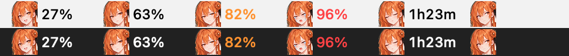
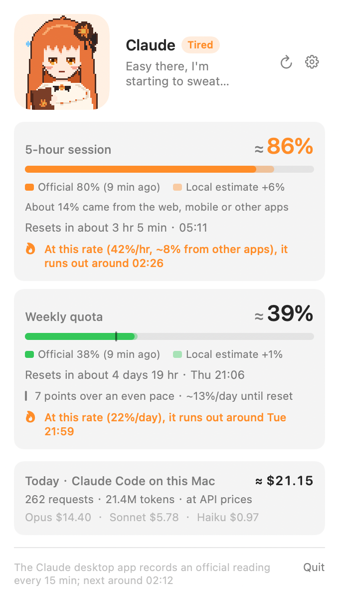
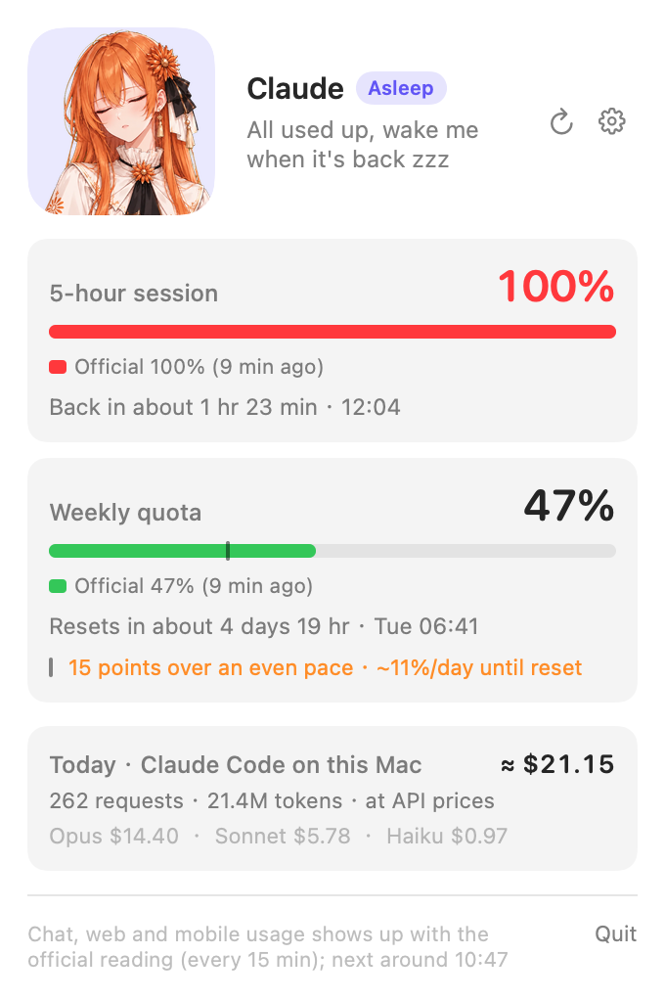
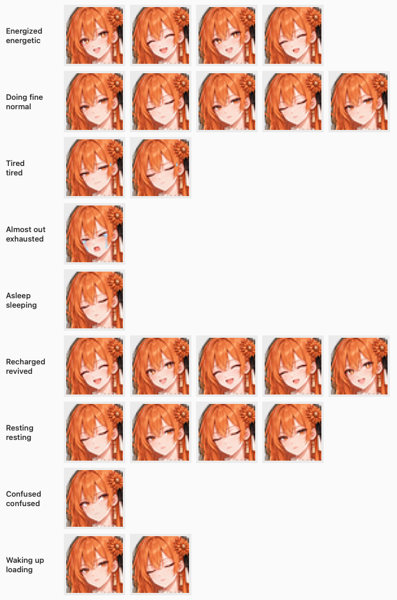
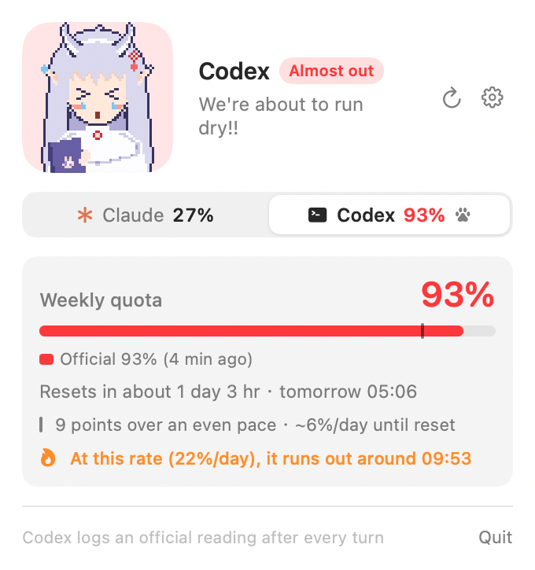
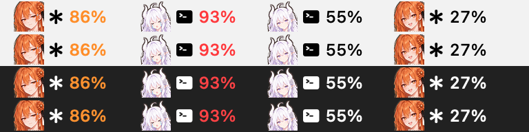

<div align="center">


# QuotaPet

[简体中文](README.md) · **English**

**A pixel-art pet that lives in your macOS menu bar and shows your Claude subscription usage in real time, with Codex alongside if you use it.**<br>
The tighter your quota gets, the more tired she looks. When it runs out she falls asleep and tells you when it comes back.



Reads local files only · No network · No login credentials

</div>

<p align="center">
  <picture>
    <source media="(prefers-color-scheme: dark)" srcset="docs/images/popover-busy-en-dark.png">
    
  </picture>
  &nbsp;
  <picture>
    <source media="(prefers-color-scheme: dark)" srcset="docs/images/popover-limited-en-dark.png">
    
  </picture>
</p>

## Features

- **Usage at a glance**: the menu bar shows the pet plus your 5-hour usage. The number turns orange above 75% and red above 90%; once you hit the limit it switches to a countdown such as `1h23m`
- **Details on click**: 5-hour and weekly usage, when each resets, your recent burn rate, "at this rate you'll run out at…", and whether your weekly usage is over or under an even pace, with how much you can use per day until the reset
- **Live between official readings**: official readings only arrive every 15 minutes, so in between QuotaPet estimates from Claude Code's local logs, using a conversion rate it learns from your own data
- **Only the notifications that matter**: one alert each at 75% / 90% / 100%, a heads-up when the recent pace will run you out soon (about 30 minutes ahead for the 5-hour window, a day ahead for the weekly quota), and one when your quota resets
- **Codex too**: if you use Codex on this Mac, it's picked up automatically. Switch between the two in the popover, and the pet follows whichever is tighter ([more below](#codex-too))
- **Follows Claude**: the pet appears when the Claude desktop app opens and hides when it quits (if you use Codex, its desktop app counts too; or set it to always show)
- **English and Simplified Chinese**: follows your system language, or pick one in Settings

## Pet moods

Her mood follows whichever usage window is tightest:

| Usage | Mood | Looks like |
|---|---|---|
| < 50% | Energized | Sparkly eyes, a star twinkling above her head |
| 50–75% | Doing fine | Quietly watching you, blinking now and then |
| 75–90% | Tired | Droopy eyes, a bead of sweat sliding down |
| 90–100% | Almost out | `>_<`, tears falling |
| ≥ 100% | Asleep | Eyes closed, Z's floating up |
| No data | Confused | A question mark pops up |



Claude has four looks to choose from in Settings: Classic, Cat ears, Youthful and Witch. Codex has three of its own: Dragon girl, Hanfu and Geek.

## Codex too

If you use Codex (CLI or desktop app) on this Mac, QuotaPet picks up its usage automatically. There's nothing to set up:

- A Claude / Codex switcher appears at the top of the popover, showing both percentages. The popover always opens on whichever is tighter
- The pet and the menu bar number follow whichever of the two is tighter, and a small icon in front of the number tells you which one it is: the asterisk is Claude, the terminal is Codex
- Codex has its own set of pets (Dragon girl, Hanfu and Geek; pick one in Settings → Codex), separate from Claude's four, so you can tell the two apart at a glance
- Don't want Codex? Turn it off in Settings → Codex, and the popover, menu bar and alerts only cover Claude

<p align="center">
  <picture>
    <source media="(prefers-color-scheme: dark)" srcset="docs/images/popover-codex-tab-en-dark.png">
    
  </picture>
  <br>
  
</p>

## Install

Requires macOS 14 or later, on Apple silicon or Intel.

### Download

1. Download `QuotaPet-<version>.zip` from [Releases](https://github.com/caihaodong44chd-gif/claude-quota-pet/releases/latest), unzip it and drag QuotaPet into your Applications folder.
2. Double-click to open. QuotaPet isn't signed with a paid Apple Developer ID, so the first time macOS blocks it because it can't verify the developer: click Done, go to System Settings → Privacy & Security, scroll to the bottom and click Open Anyway. You only need to do this once.
   Or run `xattr -dr com.apple.quarantine /Applications/QuotaPet.app` in Terminal.
3. On first launch the pet appears in the menu bar and opens its popover to show what data it found. If it's in the Applications folder, launch at login is turned on too.

### Build from source

The Command Line Tools (`xcode-select --install`) are enough; you don't need Xcode.

```bash
git clone https://github.com/caihaodong44chd-gif/claude-quota-pet.git
cd claude-quota-pet/QuotaPet
make install    # build, install to ~/Applications and turn on launch at login
```

### After installing

Official usage readings are recorded by the [Claude desktop app](https://claude.ai/download), so install it and sign in. After that, the pet shows up on the right side of the menu bar whenever Claude is open. On first launch macOS asks whether QuotaPet may send notifications; allow it to get usage alerts. If you declined, Settings shows a note with a button that takes you to System Settings to turn them on.

Just want a look first? `make demo` runs one cycle with fake data and shows every mood in 75 seconds.

Other commands, run in `QuotaPet/`:

```bash
make run        # build QuotaPet.app into build/ and launch it
make release    # universal build (Apple silicon + Intel) zipped for a GitHub Release
make check      # run the self-checks
make previews   # render the pet, menu bar and popover to PNGs in build/previews
```

## Using it

- **Left-click** the pet to open the popover; **right-click** for Refresh, Settings and Quit.
- By default the pet **follows the Claude desktop app**: it appears when Claude opens and hides when Claude quits (reset notifications still arrive in the background). If you use Codex, the Codex desktop app counts too. If the pet is hidden and you want to check your usage, open QuotaPet again from Spotlight and the popover pops up.
- In the popover, the weekly bar has a small tick where you'd be at an even pace. The line below says how many points you're over or under it and how much you can use per day until the reset (orange when you're 10 or more points over). For Claude it appears once the weekly reset time is known: after QuotaPet has seen one reset, or when you set the reset time manually in Settings.
- To appear automatically with Claude, QuotaPet has to launch at login (`make install` and the first launch from Applications turn this on). To turn it off: QuotaPet Settings → General, or System Settings → General → Login Items.

Settings (right-click → Settings…) has a page per topic:

| Page | Options |
|---|---|
| General | Menu bar: when to show (when Claude, or Codex if you use it, is open / always), what to show next to the pet (pet only / 5-hour / 5h + week / highest), animation, monochrome pet. Notifications: usage alerts and thresholds (50 / 75 / 90 / 100%, default 75 / 90 / 100), warn before running out, notify when quota resets. Other: language (system / 简体中文 / English), launch at login |
| Claude | Pet style (Classic / Cat ears / Youthful / Witch). Live estimate: estimate from local logs, learn the conversion rate automatically (shows the current value), set the weekly reset time manually |
| Codex (only if you use it) | Show Codex usage, pet style (Dragon girl / Hanfu / Geek), where the data comes from and when the last reading arrived |

**Can't see the pet?** On MacBooks with a notch, menu bar icons that don't fit are hidden behind the notch. QuotaPet places itself on the far right, next to the clock, the first time it runs. If it's still hidden: hold ⌘ and drag menu bar icons to reorder them, hide icons you don't need in System Settings → Menu Bar, or switch QuotaPet to "Pet only" to save half the width.

## Where the data comes from

| Data | Source |
|---|---|
| Official 5-hour / weekly % | `~/Library/Application Support/Claude/plan-usage-history.json`, written by the Claude desktop app every 15 minutes |
| Changes between readings | Claude Code's local logs `~/.claude/projects/**/*.jsonl`: token counts are priced at API rates, then converted to a percentage with the learned conversion rate |
| Reset times | Inferred: a window starts at the first use after the previous window ended. When Claude Code hits a limit, the exact reset time from the server's reply in the log is used |
| Codex % and reset times | The usage fields (`rate_limits`) Codex writes to `~/.codex/sessions/**/*.jsonl` after every turn. These are official numbers from the server, so nothing is estimated |

- **Learned conversion rate**: "how many dollars of API usage ≈ 1% of quota". One number for all models: quota usage turns out to be roughly proportional to API price, and thinking effort needs no separate factor because thinking tokens are billed as output. The one exception is cache reads, which count for only about half. The rate starts at $0.27 per 1% of the 5-hour window and is learned continuously from your own readings (recent data weighs more, with a 3-hour half-life). Settings shows the current value.
- **Local records**: every 15-minute interval (how much the official reading rose, and what Claude Code spent locally) is appended to `~/Library/Application Support/QuotaPet/intervals.jsonl`, so the history survives Claude Code cleaning up old logs.
- Usage from chat (including the desktop app), the web and mobile isn't in the local logs, so it shows up with the next official reading (at most 15 minutes later). Whatever the official increase can't be explained by local logs is counted as usage from other apps; the popover shows how much each window got from them, and includes it in the burn rate and the "run out at" estimate.
- Estimates top out at 99%. Only an official reading or a limit message from Claude Code can declare "used up", so the pet doesn't fall asleep or send a false alert.
- Codex readings only update when you use Codex on this Mac, so usage from the web or cloud tasks shows up the next time you use it here. QuotaPet reads only the usage fields in the conversation logs, never `~/.codex/auth.json` or any other login credentials.

## Usage lab

[`usage_lab.py`](usage_lab.py) is the experiment tool that came before the app (its output is in Chinese). It lines up Claude Code's per-request token logs with official usage readings and uses regression to estimate "1% of quota ≈ how many dollars of API usage". It uses only the Python standard library.

```bash
python3 usage_lab.py summary --hours 24             # token usage per model over the last 24 hours
python3 usage_lab.py snap 40 12 --note start         # record a manual snapshot (5-hour %, weekly %)
python3 usage_lab.py ratio                          # ratio between weekly % and 5-hour %
python3 usage_lab.py calibrate --since 2026-09-25T10:00   # regression
python3 usage_lab.py backtest                       # replay the live estimate interval by interval, the way the app learns
```

Current conclusions: a single rate for all models fits best, thinking effort needs no separate factor, but cache reads count for only about half (on that basis, about $0.27 ≈ 1% of the 5-hour quota). The experiments are written up in section 7 of the [product plan](docs/PRODUCT_PLAN.md) (in Chinese).

## Project layout

```
QuotaPet/             menu bar app (Swift + SwiftUI, built with SwiftPM)
  Sources/            QuotaPetCore (pure logic) / QuotaPet (the app) / QuotaPetChecks (self-checks)
  design/             Python prototypes of the pixel art
usage_lab.py          usage lab
docs/PRODUCT_PLAN.md  product plan and measurements (in Chinese)
```

Code structure, adding support for other AI tools, and redrawing the pet are covered in [QuotaPet/README.md](QuotaPet/README.md) (in Chinese).

## Notes

- This is a personal project. It is not an official Anthropic or OpenAI tool and has no affiliation with either company.
- Official readings come from an internal file of the Claude desktop app and from Codex's conversation logs, and their formats may change at any time. If they can't be read, the pet looks confused and the popover explains why.
- Apart from the official readings, all numbers are estimates and may be off by a few percentage points.

## Feedback

Used it? Like it, hate it, hit a bug — [open an issue](https://github.com/caihaodong44chd-gif/claude-quota-pet/issues/new?template=feedback.yml).

## License

[MIT](LICENSE)
