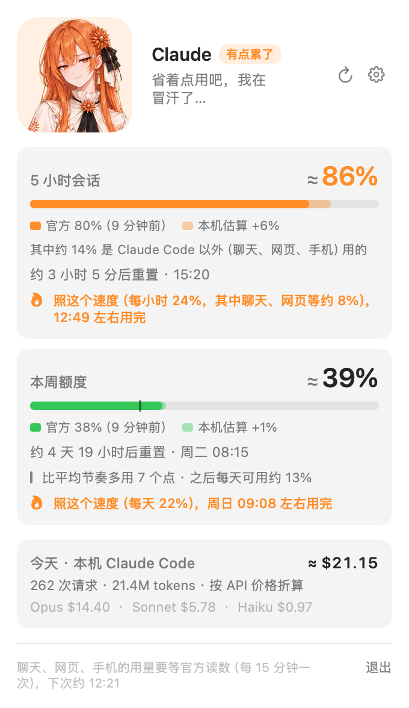
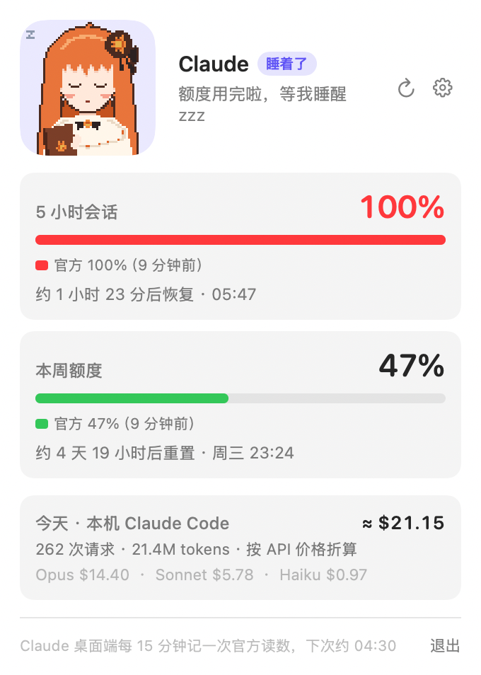
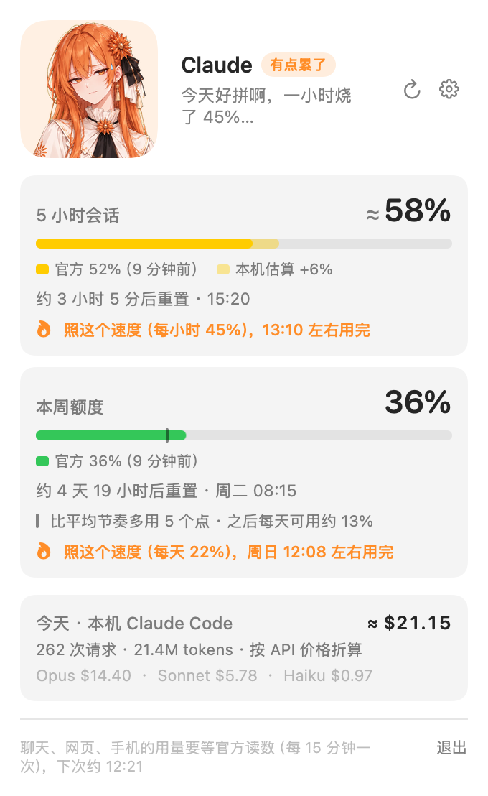
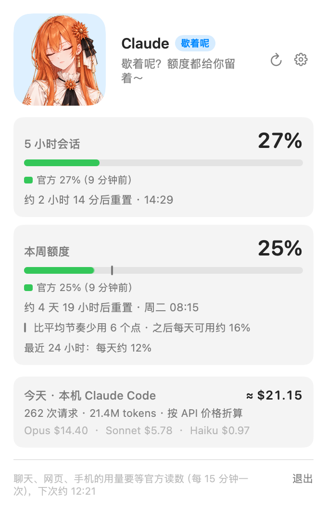
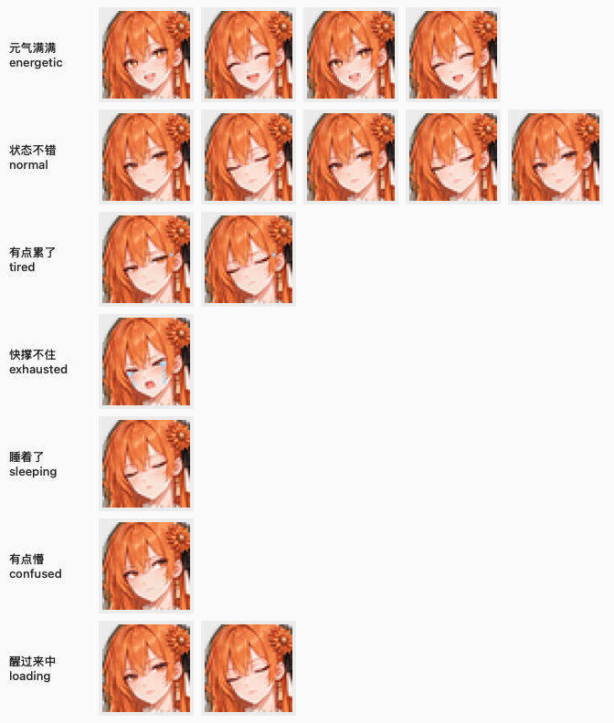
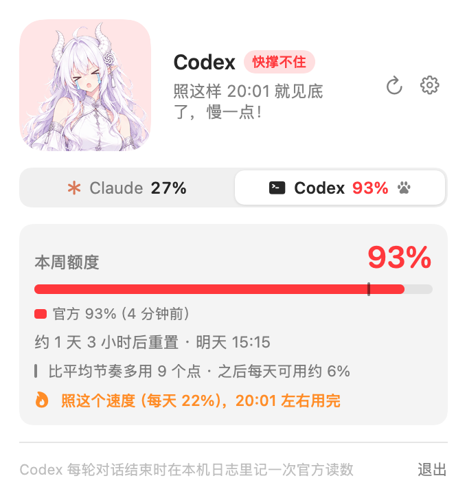

<div align="center">


# QuotaPet 额度宠物

**简体中文** · [English](README.en.md)

**住在 macOS 菜单栏里的二次元小人，实时显示你的 Claude 订阅额度，也能一起看 Codex 的。**<br>
额度越紧张她越累，用完了就睡着，还会告诉你多久后恢复。


只读本机文件 · 不联网 · 不读登录凭据

</div>

<p align="center">
  <picture>
    <source media="(prefers-color-scheme: dark)" srcset="docs/images/popover-busy-dark.png">
    
  </picture>
  &nbsp;
  <picture>
    <source media="(prefers-color-scheme: dark)" srcset="docs/images/popover-limited-dark.png">
    
  </picture>
</p>

## 能做什么

- **一眼看额度**：菜单栏上是宠物加 5 小时额度的百分比；75% 以上数字变橙，90% 以上变红，被限流时改成恢复倒计时，比如 `1h23m`
- **点开看细节**：5 小时和本周额度、多久后重置、最近的消耗速度、「照这个速度几点用完」，以及本周额度比平均节奏多用还是少用了、之后每天还能用多少
- **两次官方读数之间也是实时的**：官方读数 15 分钟才有一次，中间用 Claude Code 的本机日志估算，换算率从你自己的数据里自动学
- **不用等到跨档位才有反应**：烧得快她会先慌起来，闲着会歇着，额度刚恢复会开心一阵；说的话也跟着实际情况走，点她一下还有回应（[详见下面](#宠物心情)）
- **只在该提醒的时候提醒**：跨过 75% / 90% / 100% 各提醒一次；照最近的速度快用完时提前说一声（5 小时额度提前约半小时，每周额度提前约一天）；额度恢复时说一声
- **也看 Codex**：本机用过 Codex 的话自动接进来，面板上切换着看，宠物跟着两家里更紧张的那个（[详见下面](#同时看-codex)）
- **跟着 Claude 走**：打开 Claude 桌面端宠物就出现，关掉就藏起来（在用 Codex 时 Codex 桌面端也算；也可以设成一直显示。只用命令行、没装桌面端时自动一直显示）
- **中英双语**：界面跟随系统语言，也可以在设置里切换（English UI available）

## 宠物心情

心情先看最紧张的那个额度窗口用了多少：

| 使用率 | 状态 | 样子 |
|---|---|---|
| < 50% | 元气满满 | 星星眼，开心地笑 |
| 50–75% | 状态不错 | 安静地看着你，隔一会儿眨眨眼 |
| 75–90% | 有点累了 | 半睁眼，太阳穴冒汗 |
| 90–100% | 快撑不住 | `>_<`，掉眼泪 |
| ≥ 100% | 睡着了 | 闭上眼，睡得很香 |
| 读不到数据 | 有点懵 | 挑着眉，一脸疑惑 |

再看趋势，不用等到跨过档位她就有反应：

| 情况 | 她的反应 |
|---|---|
| 照最近的速度，半小时内就会用完（每周额度是一天内） | 提前哭，告诉你几点见底 |
| 5 小时额度照这个速度撑不到重置 | 还没到 75% 就先慌起来：睁大眼、抿着嘴、冒汗 |
| 额度刚恢复 | 开心一阵：「满血复活！」 |
| 额度不紧张，又有半小时没用了 | 闭上眼歇着 |

只有额度真的用完了（官方读数到 100%，或者被限流），她才会睡着。

<p align="center">
  <picture>
    <source media="(prefers-color-scheme: dark)" srcset="docs/images/popover-rush-dark.png">
    
  </picture>
  &nbsp;
  <picture>
    <source media="(prefers-color-scheme: dark)" srcset="docs/images/popover-idle-dark.png">
    
  </picture>
</p>

她在面板上说的话也跟着实际情况走：几点见底、多久后恢复、这周比平均节奏多用还是少用、别处是不是也在用；同一种情况有几句，每次点开换一句。点她一下，她会做个表情、回你一句；连着戳个不停，她会闹别扭。



一共八款形象。Claude 有五款，在「设置 → Claude」里选；Codex 有自己的三款：

<p align="center">
  <picture>
    <source media="(prefers-color-scheme: dark)" srcset="docs/images/styles-dark.png">
    
  </picture>
</p>

每款都有十四个表情。汗珠、眼泪直接画在表情里，睡着、有点懵、刚被叫醒都是单独的表情。

## 同时看 Codex

在这台 Mac 上用过 Codex（命令行或桌面端）的话，QuotaPet 会自动把它的额度也接进来，不用设置：

- 面板顶部多一个 Claude / Codex 切换条，上面带着两家的百分比；每次点开先看更紧张的那家
- 宠物和菜单栏上的数字跟着两家里更紧张的那个，数字前面的小图标告诉你是哪家：星号是 Claude，终端是 Codex
- Codex 有自己的一组宠物：龙娘、汉服、极客，在「设置 → Codex」里选；和 Claude 的五款互不重叠，一眼就能分开
- 不想看 Codex 的话，在「设置 → Codex」里关掉，面板、菜单栏和提醒就只管 Claude

<p align="center">
  <picture>
    <source media="(prefers-color-scheme: dark)" srcset="docs/images/popover-codex-tab-dark.png">
    
  </picture>
  <br>
  
</p>

## 安装

需要 macOS 14 以上，Apple 芯片和 Intel 都能用。

### 直接下载

1. 在 [Releases](https://github.com/caihaodong44chd-gif/claude-quota-pet/releases/latest) 下载 `QuotaPet-版本号.zip`，解压后把「额度宠物」拖进「应用程序」文件夹。
2. 双击打开。QuotaPet 没有花钱买苹果的开发者签名，第一次打开 macOS 会拦下来，说无法验证开发者：点「完成」，到「系统设置 → 隐私与安全性」拉到最下面，点「仍要打开」。只需要这一次。
   也可以在终端里执行 `xattr -dr com.apple.quarantine /Applications/QuotaPet.app` 解除拦截。
3. 第一次打开时宠物会出现在菜单栏，并弹出面板说明读到了哪些数据；放在「应用程序」文件夹里的话，会顺便打开开机自启。

### 从源码编译

装命令行工具（`xcode-select --install`）就够，不需要 Xcode。

```bash
git clone https://github.com/caihaodong44chd-gif/claude-quota-pet.git
cd claude-quota-pet/QuotaPet
make install    # 编译，装到 ~/Applications，并打开开机自启
```

### 装好以后

官方额度读数是 [Claude 桌面端](https://claude.ai/download)记录的，所以要装好并登录它。之后一打开 Claude，宠物就会出现在菜单栏右边。第一次启动时 macOS 会问要不要允许通知，选允许才能收到用量提醒；选了不允许的话，设置页会提示并带你去系统设置里打开。

只想先看看效果的话，`make demo` 会用假数据跑一轮，75 秒看完宠物的所有状态。

**用在别的电脑上**：每台 Mac 各装一份，按上面的步骤来。QuotaPet 只读这台 Mac 上的文件，不联网，设备之间不同步，所以每台显示的是它自己看到的用量：

- Claude：这台 Mac 上要装好并登录 Claude 桌面端，否则只有 Claude Code 日志估算出来的数。
- Codex：这台 Mac 上用过 Codex，面板里才会出现 Codex 页签。
- 在手机、网页、别的电脑，或者 Dot 这样的云端任务里用掉的额度，要等这台 Mac 的下一次官方读数（Claude 每 15 分钟一次）或下一次在本机用 Codex 才看得到。Codex 的读数超过 1 小时没更新时，面板会提示。

用法、设置项和代码结构见 [QuotaPet/README.md](QuotaPet/README.md)。

## 数据从哪来

| 数据 | 来源 |
|---|---|
| 官方 5 小时 / 每周 % | Claude 桌面端每 15 分钟写一次的 `~/Library/Application Support/Claude/plan-usage-history.json` |
| 两次读数之间的变化 | Claude Code 的本机日志 `~/.claude/projects/**/*.jsonl`：按 API 价格折成美元，再用自动学到的换算率换成百分比 |
| 重置时间 | 推算：窗口从上一个窗口结束后的第一次使用开始计时；Claude Code 被限流时，用日志里服务器给的精确恢复时间 |
| Codex 的 % 和重置时间 | Codex 每轮对话结束时写进 `~/.codex/sessions/**/*.jsonl` 的额度字段（`rate_limits`），是服务器给的官方数字，不用估算 |

- 聊天（含桌面端）、网页端和手机端的用量不在本机日志里，要等下一次官方读数（最多 15 分钟）才会体现。读数到了以后，官方增量里本机日志解释不了的部分算作「其他端」用量：面板会标出每个窗口里其他端用了多少，消耗速度和「几点用完」也会算上它。
- 估算值最多显示到 99%，只有官方读数或 Claude Code 的限流消息能宣布「用完了」，免得宠物误睡、误发提醒。
- Codex 的读数只在本机用 Codex 时更新，网页或云端任务（比如 Dot）的用量要等下次在本机用时才看得到，超过 1 小时没更新时面板会提示。QuotaPet 只读对话日志里的额度字段，不读 `~/.codex/auth.json` 等登录凭据。

## 额度实验室

[`usage_lab.py`](usage_lab.py) 是做这个 App 之前的实验工具：把 Claude Code 的逐请求 token 记录和官方额度读数按时间对齐，用回归估算「1% 额度 ≈ 多少美元的 API 用量」。只用 Python 标准库。

```bash
python3 usage_lab.py summary --hours 24             # 最近 24 小时各模型的 token 用量
python3 usage_lab.py snap 40 12 --note 实验开始      # 手动记一个额度快照（5 小时 %、每周 %）
python3 usage_lab.py ratio                          # 每周 % 和 5 小时 % 的换算比
python3 usage_lab.py calibrate --since 2026-09-25T10:00   # 回归
python3 usage_lab.py backtest                       # 按 App 的学习方式逐区间回测实时估算
```

目前的结论：所有模型用同一个系数最准，思考程度（effort）不用单独算，但缓存读在额度里只算一半左右（按这个口径，约 $0.27 ≈ 1% 的 5 小时额度）。实验过程见[产品规划](docs/PRODUCT_PLAN.md)第 7 节。

## 目录

```
QuotaPet/             菜单栏 App（Swift + SwiftUI，SwiftPM 构建）
  Sources/            QuotaPetCore 纯逻辑 / QuotaPet App 本体 / QuotaPetChecks 自检
  design/painted/     宠物形象的脚本：出提示词，把 GPT 出的图切成 App 用的图
usage_lab.py          额度实验室
docs/PRODUCT_PLAN.md  产品规划和实测记录
```

## 说明

- 这是个人项目，不是 Anthropic 或 OpenAI 的官方工具，和它们也没有关系。
- 官方读数来自 Claude 桌面端的内部文件和 Codex 的对话日志，格式随时可能变。读不了的时候宠物会显示「有点懵」，面板里会说明原因。
- 除了官方读数，其他数字都是估算，可能差几个百分点。

## 反馈

用完感觉怎么样、有没有遇到问题，欢迎[提个 issue](https://github.com/caihaodong44chd-gif/claude-quota-pet/issues/new?template=feedback.yml)。

## 许可证

[MIT](LICENSE)
